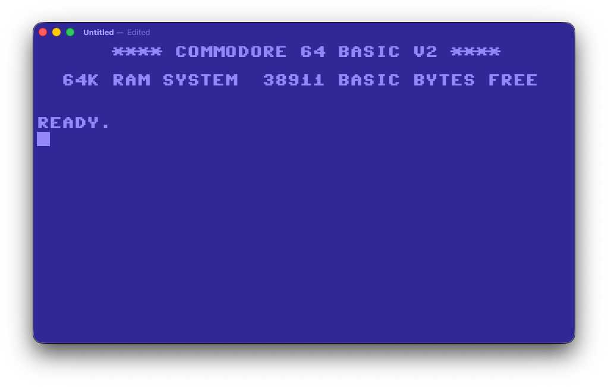

# Ready64

**Modern macOS text editing inside a Commodore 64.**

Ready64 is a native macOS plain-text editor that recreates the look and feel of the classic Commodore 64 BASIC screen. It is **not** an emulator, BASIC interpreter, or VIC-II reimplementation. Under the C64 skin it behaves like a real Mac text editor.



## Highlights

- Native macOS document-based app (SwiftUI + AppKit)
- `NSTextView` editing engine (undo/redo, selection, clipboard, find, scrolling)
- UTF-8 plain-text documents (`.txt`) — open/save with TextEdit, BBEdit, VS Code, etc.
- C64-inspired colors, monospaced fonts, and blinking block cursor
- Optional classic startup banner for new documents
- Settings for font choice and new-document banner
- No networking, accounts, telemetry, or proprietary document format

## Requirements

- macOS 14.0 or later
- Xcode 15+ (Xcode 26/27 beta also works)
- Apple Silicon or Intel Mac

## Build & run

1. Clone the repo:

   ```bash
   git clone https://github.com/mingistech/Ready64.git
   cd Ready64
   ```

2. Open `Ready64.xcodeproj` in Xcode.

3. Select the **Ready64** scheme and run (**⌘R**).

Or from the command line:

```bash
xcodebuild -project Ready64.xcodeproj -scheme Ready64 -configuration Debug \
  -destination 'platform=macOS,arch=arm64' build
open build/DerivedData/Build/Products/Debug/Ready64.app   # if using -derivedDataPath build/DerivedData
```

## Using Ready64

| Action | Shortcut |
| --- | --- |
| New document | ⌘N |
| Open | ⌘O |
| Save / Save As | ⌘S / ⇧⌘S |
| Undo / Redo | ⌘Z / ⇧⌘Z |
| Cut / Copy / Paste | ⌘X / ⌘C / ⌘V |
| Select All | ⌘A |
| Find | ⌘F |
| Settings | ⌘, |

**Settings → New Documents** can insert the C64 BASIC startup banner into new files. When enabled, that text becomes real document content and is saved with the file.

**Settings → Appearance** chooses among bundled Commodore-style fonts:

- Commodore 64
- Commodore 64 Angled
- Commodore 64 Rounded

Font and colors are presentation-only. They are **not** written into the `.txt` file.

## Project notes

### Design philosophy

Ready64 intentionally juxtaposes:

1. Standard macOS window chrome, menus, and shortcuts  
2. A nostalgic C64 editing surface  

Documents remain ordinary UTF-8 text. The retro UI never owns the file format.

### Architecture

| Area | Role |
| --- | --- |
| `Ready64App` | `DocumentGroup` scene + Settings |
| `TextDocument` | UTF-8 `FileDocument` |
| `EditorView` | C64 presentation chrome |
| `Ready64TextView` | SwiftUI ↔ AppKit bridge |
| `Ready64NSTextView` | Block cursor + indicator suppression |
| `Ready64TextStorage` | Avoids AppKit font substitution for legacy C64 faces |
| `Ready64Theme` / `Ready64Font` / `Ready64Layout` | Centralized palette, typeface, geometry |
| `SettingsView` | Font + startup-banner preferences |

### Current theme colors

| Role | Hex |
| --- | --- |
| Screen background | `#2F2896` |
| Text / cursor | `#9387FB` |
| Border (when enabled) | `#453BBF` |

Border width is currently `0` (full-bleed screen). Increase `Ready64Layout.borderWidth` to restore a frame.

### Fonts

Bundled under `Ready64/Resources/Fonts/`. The classic `Commodore-64-v6.3.TTF` face is a legacy Mac-cmap font; Ready64 uses a custom text storage so AppKit does not replace it with Helvetica.

Only add or redistribute fonts if their licenses allow it. See `Ready64/Resources/Fonts/README.txt`.

### Known implementation notes

- The blinking **block cursor** is drawn by Ready64; modern macOS `NSTextInsertionIndicator` is suppressed.
- Soft wrapping is a view concern only and does not alter saved newlines.
- Unicode is fully supported in the document model; glyph coverage depends on the selected font.
- Default new-window size is 911×540 points; editor font size defaults to 27pt with a little extra line spacing.

## Roadmap (not implemented yet)

- Authentic 40×25 / 80-column viewing modes
- Additional Commodore palettes / user themes
- PETSCII palette / authentic input mode
- CRT scanlines, glow, curvature
- Boot animation separate from document text
- Status bar (line/column, counts)
- Markdown / `.log` / extensionless text as first-class types

## What this is not

- Not a Commodore 64 emulator  
- Not a BASIC interpreter  
- Not Electron / web / Catalyst  
- Not an IDE  

## License

Ready64 source is released under the MIT License. See [LICENSE](LICENSE).

Bundled third-party fonts remain under their own licenses; do not assume MIT covers those files.
